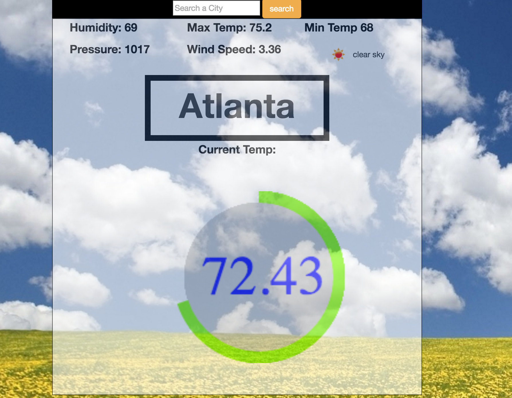

#Weather App created using an API and the ol' HTML Canvas tag
### Retreived weather data from weathermap.org API
###Using canvas created a dynamic arc coresponding to the current temperature.
###Needs some styling love, but it's still pretty Sweet

